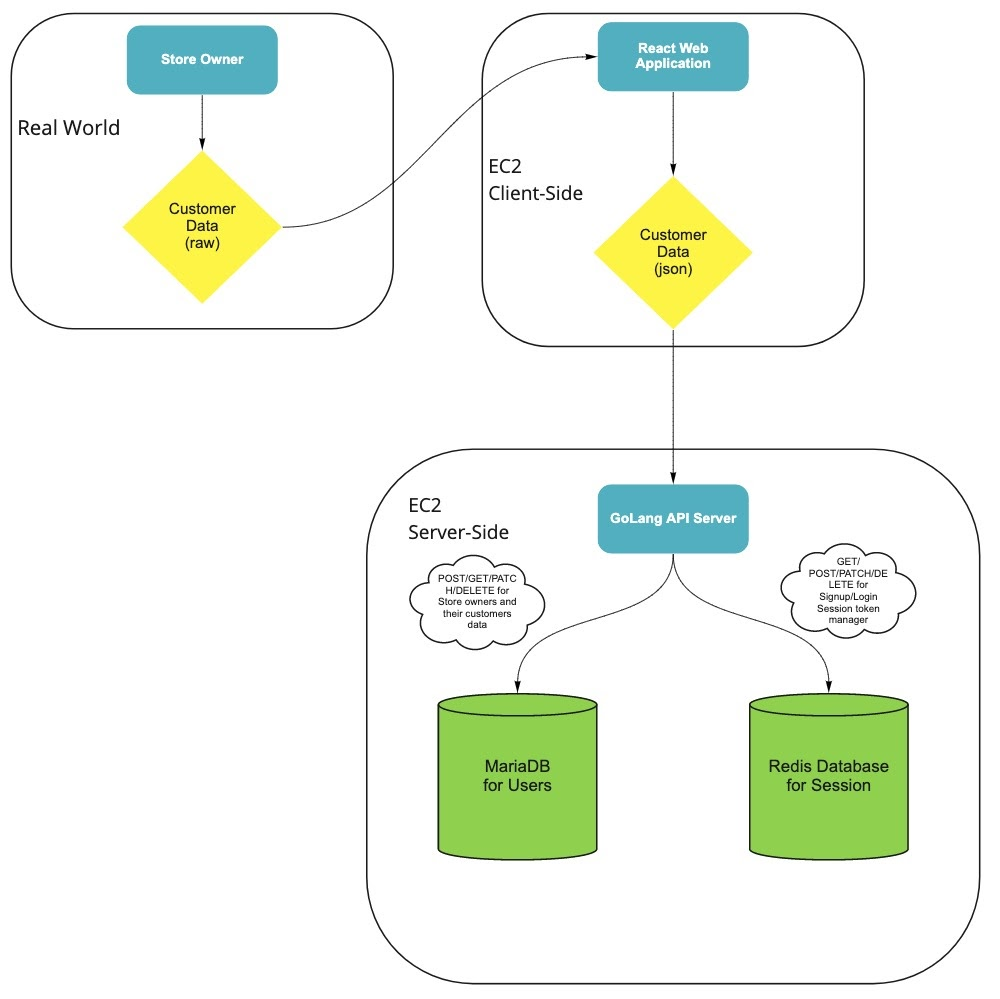

# Customer Data Visualization Portal

### Project Description

Our target audience are store owners who wish to learn more about their customers' information. Without a convenient tool, owners would have to manually write down visitors’ information with pen and pencil to record them. 

To better assist them with this need, our project will provide the functionality of recording clients’ demographic characteristics and purchases and present them with clear visualizations, which will allow store owners to conveniently and efficiently gain insights about their customers.

We as developers have friends and relatives who own small businesses, and they can utilize this service to understand their customers better. They will not have to manually record their visitors' information while struggling to remember what each of them like or find their target audience.

### Technical Description

**Architectural Diagram Mapping**

**Summary Table of User Stories**

Priority | User | Description | Technical Implementation Strategy
---|---|---|---|
| P0       | As a store owner | I want to input and store customer information               | Use ReactJS to implement forms to input customer information. Use Go API server to accept data from clients and save to the database. Use MariaDB database to maintain normalized data with defined tables. |
| P0       | As a store owner | I want to see table representation of customer analytics     | Use html and css to create tables that show summary data of clients’ information or purchases based on relevant queries. visualization of current user’s saved customers.                                   |
| P1       | As a store owner | I want to see graphical representation of customer analytics | Use D3.js to create graphs or charts of clients’ information or purchases based on relevant queries.     
 

 **Available Endpoints**

Endpoints|Purpose
|---|---|
| GET /user/{id}                  | Return service user’s information                    |
| POST /user                      | Sign up new user                                     |
| PATCH /user                     | Update user information                              |
| POST /sessions                  | Sign in user and start session                       |
| DELETE /sessions                | Delete current user’s session and sign out           |
| GET user/{id}/customers/{id}    | Return specific customer by current user             |
| GET user/{id}/customers         | Return all customers by current user                 |
| POST user/{id}/customers        | Save new customer by current user                    |
| PATCH user/{id}/customers       | Update customer information by current user          |
| DELETE user/{id}/customers/{id} | Delete specific customer information by current user |

### Appendix

**Database Schemas**

| Users |  |
|---|---|
| user_id        | int not null auto_increment primary key |
| email          | varchar(225) not null unique            |
| store_name     | varchar(225) not null unique            |
| store_location | varchar(225)                            |
| created_at     | date not null                           |
| pass_hash      | binary(64) not null                     |

| Customers |    |
|---|---|
| customer_id       | int not null auto_increment primary key               |
| user_id           | int not null foreign key references Users(user_id)    |
| first_name        | varchar(225) not null                                 |
| last_name         | varchar(225) not null                                 |
| ethnicity         | varchar(225) not null                                 |
| gender            | varchar(225) not null                                 |
| birthday          | date not null                                         |
| postal _code      | int not null                                          |
| last_visited_date | date not null                                         |
| dis_channel       | int foreign key reference disChannels(disChannel_id)  |
| fav_item          | int foreign key references Items(item_id)             |

| Items (Product or services offered by the business) 	||
|---|---|
| item_id                                             | int not null auto_increment primary key            |
| store_id                                            | int not null foreign key references Users(user_id) |
| item_name                                           | varchar(225) not null                              |
| item_price                                          | money not null                                     |

| disChannels  (How the customer discover the business) 	|                                         	|
|-------------------------------------------------------	|-----------------------------------------	|
| disChannel_id                                         	| int not null auto_increment primary key 	|
| channel_type                                          	| varchar(225) not null                   	|