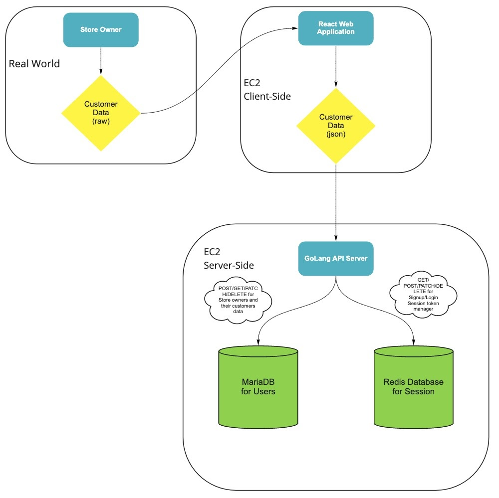
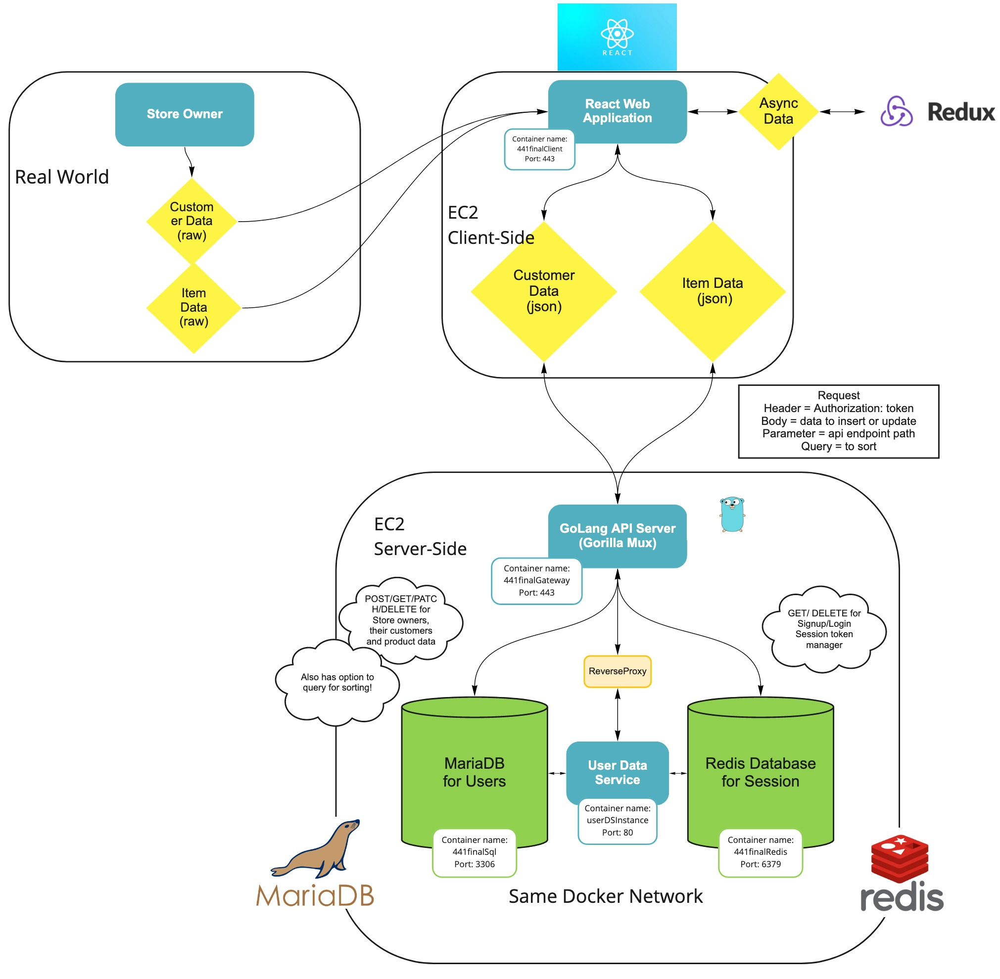

# Customer Data Visualization Portal

### Project Description

Our target audience are store owners who wish to learn more about their customers' information. Without a convenient tool, owners would have to manually write down visitors’ information with pen and pencil to record them. 

To better assist them with this need, our project will provide the functionality of recording clients’ demographic characteristics and purchases and present them with clear visualizations, which will allow store owners to conveniently and efficiently gain insights about their customers.

We as developers have friends and relatives who own small businesses, and they can utilize this service to understand their customers better. They will not have to manually record their visitors' information while struggling to remember what each of them like or find their target audience.

### Technical Description

**Architectural Diagram Mapping**




**Summary Table of User Stories**


Priority | User | Description | Technical Implementation Strategy
---|---|---|---|
| P0       | As a store owner | I want to store, update, and delete customer or product/service information               | Use ReactJS to implement forms to input customer information. Use Go API server to accept data from clients and save to the database. Use MariaDB database to maintain normalized data with defined tables. |
| P0       | As a store owner | I want to see table representation of customer data and product/services    | Use html and css to create tables that show summary data queried from the database.                                 |
| P1       | As a store owner | I want to see graphical representation of customer data | Use Victory.js to create graphs or charts of clients’ information or purchases based on relevant queries.     
| P2       | As a store owner | I want to sort table entries by each column | Have the client make request to the server with respective parameter when a column header is clicked. Implement endpoints and update handlers to take in parameter passed by the client and return sorted data to display.   

 **Available Endpoints**

| Endpoint 	| Purpose 	|
|-	|-	|
| POST /user 	| Sign up new user 	|
| GET /user/{user_id} 	| Return service user’s information 	|
| PATCH /user/{user_id} 	| Update user information 	|
| POST /sessions 	| Sign in user and start session 	|
| DELETE /sessions 	| Delete current user’s session and sign out 	|
| GET user/{user_id}/customers 	| Return all customers by current user 	|
| POST user/{user_id}/customers 	| Save new customer by current user 	|
| GET user/{user_id}/customers/{customer_id} 	| Return specific customer by current user 	|
| PATCH user/{user_id}/customers/{customer_id} 	| Update customer information by current user 	|
| DELETE user/{user_id}/customers/{customer_id} 	| Delete specific customer information by current user 	|
| GET user/{user_id}/items 	| Return all items by current user 	|
| POST user/{user_id}/items 	| Save new items by current user 	|
| GET user/{user_id}/items/{item_id} 	| Return specific item by current user 	|
| PATCH user/{user_id}/items/{item_id} 	| Update item information by current user 	|
| DELETE user/{user_id}/items/{item_id} 	| Delete specific item information by current user 	|
| GET user/{user_id}/customers/?sort={col_name}&reverse={bool} 	| Return all customers sorted by the requested column name, in descending order if reverse is true, otherwise, sort by ascending order 	|
| GET user/{user_id}/items/?sort={col_name}&reverse={bool} 	| Return all items sorted by the requested column name, in descending order if reverse is true, otherwise, sort by ascending order 	|

### Appendix

**Database Schemas**

```
create table if not exists users (
    id          int not null auto_increment,
    email       varchar(225) not null unique,
    username    varchar(225) not null unique,
    passhash    binary(64) not null,
    first_name  varchar(128) not null,
    last_name   varchar(128) not null,
    store_name  varchar(225) not null,
    primary key(id)
);

create table if not exists items (
    id          int not null auto_increment,
    user_id     int not null,
    item_name   varchar(225) not null,
    price       int not null,
    primary key(id),
    foreign key(user_id) references users(id)
);

create table if not exists customers (
    id          int not null auto_increment,
    user_id int not null,
    first_name  varchar(128) not null,
    last_name   varchar(128) not null,
    ethnicity   varchar(225) not null,
    gender      varchar(64) not null,
    birthday    date not null,
    postal_code int not null,
    last_visited    date not null,
    dis_channel varchar(225) not null,
    fav_item    int not null,
    primary key(id),
    foreign key(user_id) references users(id),
    foreign key(fav_item) references items (id)
);

create table if not exists UserSignIn (
    UserID varchar(20) not null,
    SignInTime datetime not null,
    ClientIP varchar(255) not null
);

```

### Addendum
**Updated Architectural Diagram**

